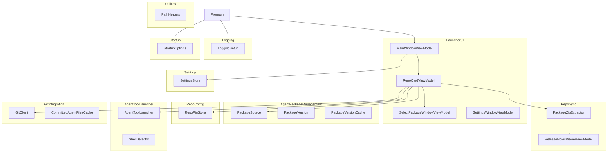

# AgentControl

## Architecture

AgentControl is an Avalonia desktop application built on .NET 10. Per architecture.md's
Purpose, it lets a developer open a repo from a recent-repos list, have the tool ensure the
repo's proprietary agent-configuration folders match a pinned package version, optionally
pull the latest commits, and then launch a preferred agentic CLI tool in that repo's working
directory. It is structured as one system containing one top-level unit (`Program`) and ten
subsystems, matching architecture.md's Software Structure diagram:

`Program` is the entry point: it parses startup arguments (`Startup`), initializes diagnostic
logging (`Logging`), and hands off to Avalonia's classic desktop lifetime, which loads
settings (`Settings`) and shows `MainWindowViewModel`'s window (`LauncherUI`). From there,
`LauncherUI`'s view-models orchestrate the remaining subsystems: `AgentPackageManagement` for
discovering available package versions, `RepoSync` for extracting a package zip's managed
folders into a repo and displaying release notes, `RepoConfig` for persisting each repo's
pin, `GitIntegration` for status/pull/branch queries, and `AgentToolLauncher` for detecting a
shell and launching the configured agentic CLI tool in it. `Utilities` provides shared,
independently testable helpers (currently safe path combination) consumed across subsystems.
See `docs/design/agent-control/{subsystem}.md` for each subsystem's own design, and
`docs/design/agent-control/program.md` for `Program`'s design (which also documents
Avalonia's `App` bootstrap responsibility, per program.sysml's documented exception for units
without a dedicated companion test file).

## External Interfaces

**Desktop UI**: The primary interface, presented via Avalonia windows.

- *Type*: GUI (Avalonia 12).
- *Role*: Provider (the application presents windows; the developer interacts via mouse/
  keyboard).
- *Contract*: The main window shows the recent-repos list with per-repo cards exposing
  Launch, Pull, Upgrade/Select Package, Favorite, and Remove actions, plus toolbar-level
  Settings and About commands (`AgentControl-System-RecentRepos`,
  `AgentControl-System-AddRemoveRepo`, `AgentControl-System-SearchAndSort`,
  `AgentControl-System-About`). Every interactive control exposes an
  `AutomationProperties.AutomationId` so FlaUI-driven end-to-end tests can locate it
  reliably (see `AgentControl-Platform-Windows`, `AgentControl-OTS-Avalonia-RenderUi`,
  `AgentControl-System-UiFramework`).
- *Constraints*: v1 ships a Windows MSI only; the Avalonia codebase remains cross-platform
  capable (see architecture.md's Open Concerns #2).

**Filesystem Package Source**: A configurable local/mapped-drive/UNC folder containing agent
package zip files.

- *Type*: File.
- *Role*: Consumer (`AgentPackageManagement`/`RepoSync` read package zips from it).
- *Contract*: Package zip filenames encode a name and a `PackageVersion`-parsable version
  (see `docs/design/agent-control/agent-package-management/package-source.md`). No
  authentication, checksum, or signature verification is performed; the security and
  integrity of the shared path is the responsibility of whoever maintains it.
- *Constraints*: Version 1 supports only a filesystem-based source; HTTP(S)/package-feed
  sources are explicitly deferred (architecture.md's Scope and Open Concerns #1).

**Per-Repo Pin File**: `.agentcontrol.json` at each tracked repo's root.

- *Type*: File.
- *Role*: Provider/Consumer (`RepoConfig` reads and writes it).
- *Contract*: Records the pinned package name and exact version for that repo; a missing
  file means the repo has no pin yet.
- *Constraints*: No "latest"/unpinned mode is supported (mandatory version pinning).

**Configured Git Executable**: The git executable used for status/pull/branch queries.

- *Type*: External process.
- *Role*: Consumer (`GitIntegration` invokes it as a subprocess).
- *Contract*: Invoked with `status`, `pull`, `rev-parse`, and `ls-files`-style arguments
  against a repo's working directory; failures are reported as result values, not unhandled
  exceptions, for the operations users trigger directly (status, pull).
- *Constraints*: Path is configurable via Settings; a missing/invalid executable raises a
  clear error rather than a silent no-op.

**Configured Agentic CLI Tool**: The developer's chosen agent tool command (e.g. GitHub
Copilot CLI), launched inside a detected shell.

- *Type*: External process.
- *Role*: Consumer (`AgentToolLauncher` starts it).
- *Contract*: Launched in the repo's working directory inside a shell appropriate to the
  current platform (see `docs/design/agent-control/agent-tool-launcher.md`), only after the
  repo's agent files are confirmed synced to the pinned version.
- *Constraints*: Configurable per Settings (well-known tool picker or custom command).

**Diagnostic Log File**: A rolling log file under `<config-dir>\logs\`.

- *Type*: File.
- *Role*: Provider (`Logging` writes to it via Serilog).
- *Contract*: Captures process-launch and git-integration detail (exit codes, timing,
  stderr, Win32 error codes) for troubleshooting; daily files with 14-day retention
  (`AgentControl-System-DiagnosticLogging`).
- *Constraints*: Supplements, not replaces, message-box error surfacing; see
  `docs/design/agent-control/logging.md`.

**Per-User Settings File**: JSON file under `%APPDATA%\AgentControl\` (or a config-directory
override for hermetic testing).

- *Type*: File.
- *Role*: Provider/Consumer (`Settings` reads and writes it).
- *Contract*: Records the package source path, git/agent-tool overrides, agent-tool
  selection, shell preference, and the recent-repos list (`AgentControl-System-Settings`).
  Returns default settings when no file exists yet (first-ever run).
- *Constraints*: Location can be overridden by a startup argument to isolate FlaUI end-to-end
  tests (see `docs/design/agent-control/startup.md`).

## Dependencies

- **Avalonia** (`AgentControl-OTS-Avalonia-RenderUi`): cross-platform UI framework rendering
  every `LauncherUI` window and control. See `docs/design/ots/avalonia.md`.
- **Serilog** (`AgentControl-OTS-Serilog-WriteLogFile`): structured-logging library backing
  the `Logging` subsystem's rolling diagnostic log file. See `docs/design/ots/serilog.md`.
- **FlaUI** (`AgentControl-OTS-FlaUI-DriveUiTests`): drives the published application's UI
  via Windows UI Automation for end-to-end test scenarios. See `docs/design/ots/flaui.md`.
- **WiX Toolset** (`AgentControl-OTS-WixToolset-BuildInstaller`): packages the published
  output into the Windows MSI installer distributed for v1. See
  `docs/design/ots/wixtoolset.md`.

## Risk Control Measures

N/A - not a safety-classified software item. The main accepted risk is the blind-delete
sync trade-off documented in `docs/design/agent-control/repo-sync.md` and architecture.md's
Open Concerns #3 (local customizations inside the four managed folders are silently removed
on the next sync/upgrade); this is a disclosed, accepted trade-off, not a defect.

## Data Flow

1. The host environment starts the process; `Program.Main` parses startup arguments via
   `StartupOptions.Parse` and initializes diagnostic logging via `LoggingSetup.Initialize`
   before anything else runs, so even startup-time failures are captured on disk
   (`AgentControl-Program-Bootstrap`, `AgentControl-Program-ErrorHandling`).
2. `Program.BuildAvaloniaApp` configures Avalonia's classic desktop lifetime. Avalonia's
   `App.OnFrameworkInitializationCompleted` loads settings via `SettingsStore.Load` (using
   the parsed configuration-directory override when present) and shows the main window,
   backed by `MainWindowViewModel`, which populates a `RepoCardViewModel` for each recent
   repo (`AgentControl-System-Startup`).
3. On each repo card's lightweight refresh, `RepoCardViewModel` reads the pin file
   (`RepoPinStore.Load`), resolves the current branch and committed-agent-files badge
   (`GitClient`, `CommittedAgentFilesCache`), and checks upgrade availability
   (`PackageSource`/`PackageVersionCache`) against the configured package source.
4. User actions on a card dispatch to the relevant subsystem: Pull to `GitClient.Pull`
   (gated on a clean working tree, `AgentControl-System-Pull`); Launch to
   `RepoCardViewModel`'s ensure-synced check (re-extracting via `PackageZipExtractor` only if
   a managed folder is missing) followed by `AgentToolLauncher.BuildProcessStartInfo`
   (`AgentControl-System-Launch`); Select Package to `PackageSource.EnumeratePackages`
   followed by `PackageZipExtractor.Extract` and `RepoPinStore.Save`
   (`AgentControl-System-SelectPackage`, `AgentControl-System-PinFile`); Upgrade to
   `PackageSource.FindLatest` followed by the same extract/pin/`ReleaseNotesViewerViewModel`
   display sequence (`AgentControl-System-Upgrade`); Settings to
   `SettingsWindowViewModel.Save`, applied back through `MainWindowViewModel.ApplySettings`
   (`AgentControl-System-Settings`).
5. Throughout, `Utilities.PathHelpers.SafePathCombine` validates any caller-supplied path
   component before file-system use, and `Logging` records process-launch and
   git-integration detail to the diagnostic log file.

## Design Constraints

- Platform: targets `net10.0`; v1 ships as a Windows MSI (`AgentControl-Platform-Windows`,
  `AgentControl-Platform-Net10`), while the Avalonia codebase itself remains cross-platform
  capable.
- Single package per repo: exactly one agent package is ever applied to a repo; merging
  multiple packages is out of scope (architecture.md's Architectural Decisions).
- Mandatory version pinning: no "latest"/unpinned tracking mode is supported.
- No elevation: the running application always executes as a normal user-level process (the
  MSI installer itself may prompt for elevation, but the app never does).
- Testability: a configuration-directory override and git/agent-tool command overrides allow
  FlaUI-driven tests to run hermetically against an isolated settings folder
  (`AgentControl-System-TestIsolation`).
- Path safety: all caller-supplied path components are validated by `PathHelpers.SafePathCombine`
  before file-system use.
